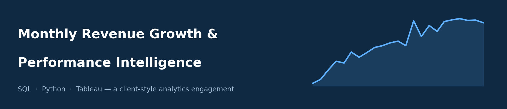
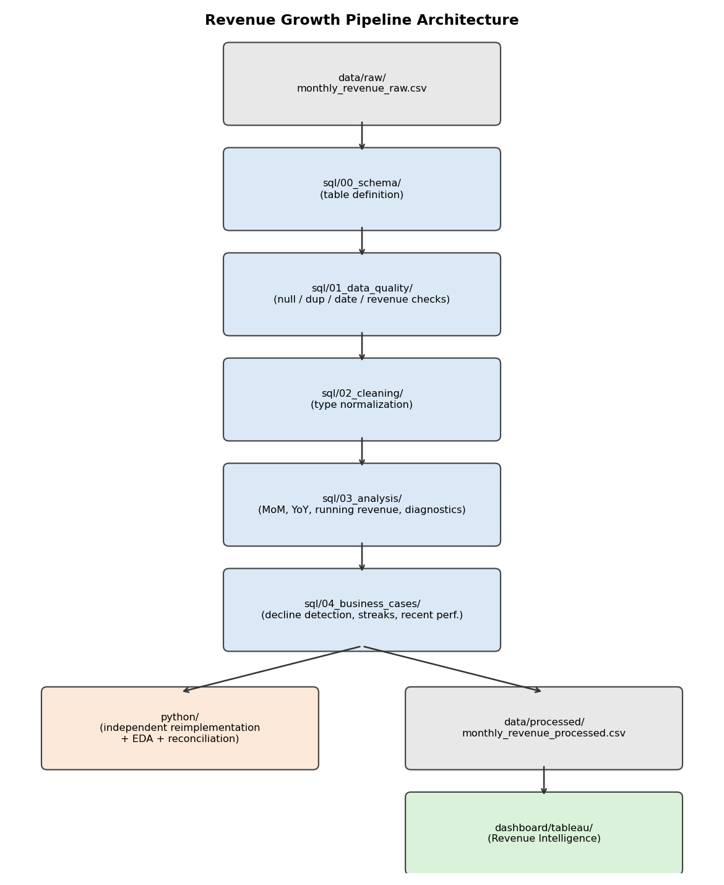
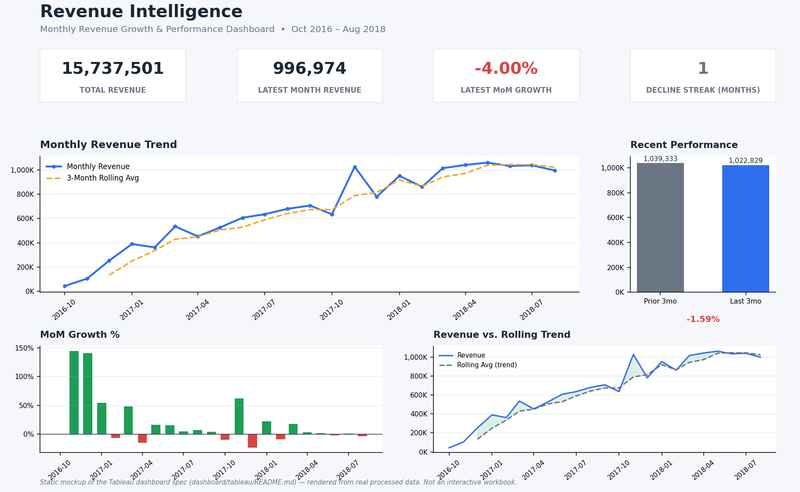
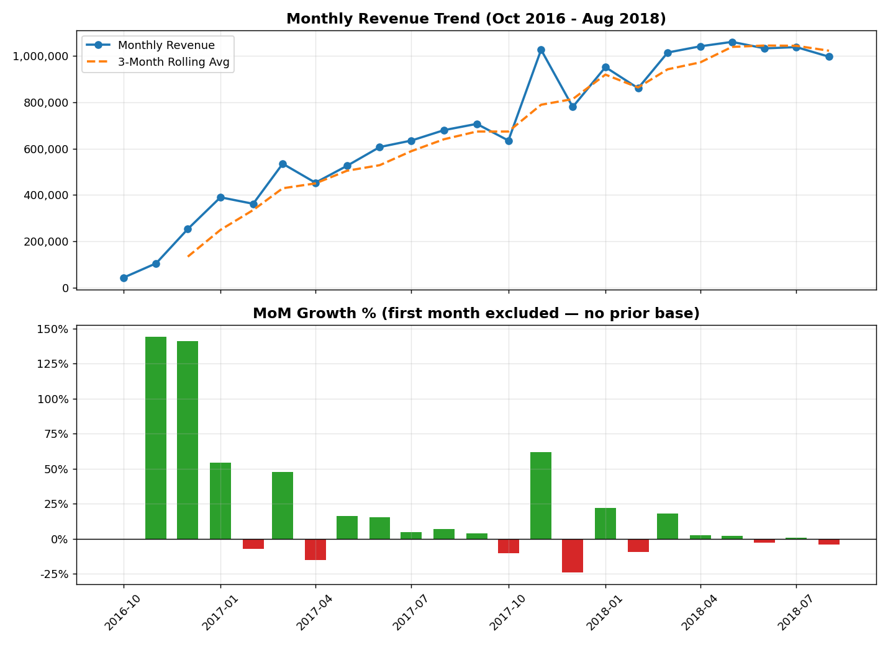
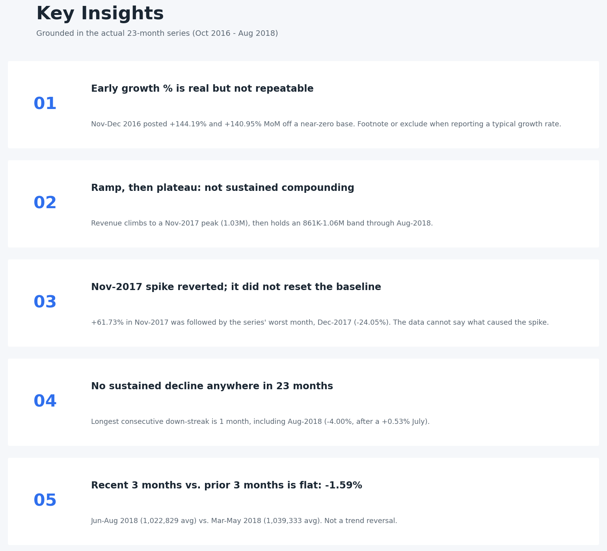

# Monthly Revenue Growth & Performance Intelligence

A SQL + Python + Tableau analytics engagement that turns a monthly revenue
extract into a governed growth-tracking pipeline: validated data, a
window-function-based SQL metric layer, an independently reconciled
Python EDA layer, and an executive dashboard.

**Value proposition:** replace ad-hoc "what's our MoM growth?" spreadsheet
pulls with one reproducible pipeline — from raw CSV to dashboard-ready
metrics — with every number traceable back to a single documented
definition.

---

## Business Problem

The business had monthly revenue figures but no centralized, reliable
layer for tracking growth, spotting momentum changes, or supporting
management decisions on demand. This project builds that layer and
answers, directly from the data:

- How much revenue is generated each month, and how is it trending?
- How is revenue changing month over month, and year over year where the
  data allows?
- Which months saw significant growth or decline — and was a decline a
  single bad month or a genuine multi-month slide?
- What is cumulative revenue over the observed period?
- Is the most recent performance improving, flat, or deteriorating?
- Where should management look closer?

**Not answered by this project:** whether revenue changes are driven by
order volume or order value. The source data has no order-level
information to support that question — see **Scope & Data Gap** below.

---

## Scope & Data Gap (read this first)

The source extract provided for this engagement
(`data/raw/monthly_revenue_raw.csv`) contains exactly two columns:
`sales_month` and `current_month_revenue` — 23 rows, monthly grain,
Oct-2016 through Aug-2018. There is no order ID, line-item, or
customer-level data anywhere in the source.

Because of that, **Order Count, Order Growth %, and Average Order Value
(AOV) are out of scope** for this version of the project — they were part
of the original brief but cannot be computed without inventing an order
count. Rather than fabricate one, this gap is documented explicitly in
[`docs/assumptions.md`](docs/assumptions.md), and every doc/query that
would have touched those metrics says so directly instead of silently
omitting them.

Everything else in the original brief — SQL engineering, window
functions, MoM/YoY growth, running revenue, data quality, Python
validation, dashboard design, executive reporting — is built at full
scope against the real data.

---

## KPI Framework

| KPI | Definition | Source |
|---|---|---|
| Current Month Revenue | Raw monthly revenue, as provided | `sql/03_analysis/01_monthly_revenue.sql` |
| MoM Growth % | `(current - previous) / previous * 100`, NULL for month 1, zero-division guarded | `sql/03_analysis/02_mom_growth.sql` |
| YoY Growth % | `(current - 12mo_prior) / 12mo_prior * 100`, valid from month 13 onward | `sql/03_analysis/03_yoy_growth.sql` |
| Running Revenue | `SUM() OVER` cumulative window | `sql/03_analysis/04_running_revenue.sql` |
| Consecutive Decline Streak | Gaps-and-islands count of unbroken MoM-negative months | `sql/04_business_cases/01_revenue_decline_detection.sql` |

Full definitions, edge cases, and caveats: [`docs/metric_definitions.md`](docs/metric_definitions.md).

---

## Architecture

```
data/raw/monthly_revenue_raw.csv
  -> sql/00_schema        (table definition)
  -> sql/01_data_quality  (null / duplicate / date / revenue checks)
  -> sql/02_cleaning      (type normalization -> vw_clean_monthly_revenue)
  -> sql/03_analysis      (MoM, YoY, running revenue, growth diagnostics)
  -> sql/04_business_cases (decline detection, acceleration, best/worst, recent performance)
  -> python/              (independent reimplementation, EDA, reconciliation)
  -> data/processed/monthly_revenue_processed.csv  (single hand-off file)
  -> dashboard/tableau/   (Revenue Intelligence dashboard, manual build)
  -> reports/executive_report.md
```

Full explanation and reproduction steps: [`docs/architecture.md`](docs/architecture.md).



---

## Dashboard Preview



*Static preview of the dashboard design, rendered from the processed data
with matplotlib. It is **not** a Tableau export — the interactive Tableau
workbook is a manual build; see
[`dashboard/tableau/README.md`](dashboard/tableau/README.md) for the
field-by-field spec and [`docs/assumptions.md`](docs/assumptions.md) for why.*



---

## Key Insights

1. **Early-period MoM growth (+144.19%, +140.95% in the first two months)
   is real but not representative** — it reflects a near-zero starting
   base, not a repeatable growth rate.
2. **Revenue shows a ramp-then-plateau shape**: steep growth through a
   Nov-2017 peak (1,027,013), then a stable ~860,000-1,061,000 band
   through Aug-2018.
3. **The Nov-2017 spike is a one-off event followed by reversion**, not a
   new baseline — Dec-2017 posted the series' worst MoM growth (-24.05%).
4. **No sustained decline exists anywhere in the data.** The longest
   consecutive-decline streak in the full 23-month series is 1 month —
   including the most recent month on record (Aug-2018, -4.00%, which
   follows a positive July).
5. **Recent performance is flat, not deteriorating**: last 3 months vs.
   prior 3 months = -1.59%, within normal volatility for this period.



Full detail with evidence and recommended actions:
[`analysis/key_insights.md`](analysis/key_insights.md).

---

## Technical Stack

- **SQL** (ANSI/PostgreSQL-compatible) — CTEs, `LAG()`, `SUM() OVER`,
  gaps-and-islands streak detection, `RANK()`
- **Python** (pandas, numpy, matplotlib) — independent validation, EDA,
  dashboard export
- **Tableau** — executive dashboard (manual build)
- **Git/GitHub** — version control and documentation

## SQL Engineering

23 SQL files across schema, data quality, cleaning, analysis, and
business-case layers. Every query is commented with its purpose and, where
non-obvious, the reasoning behind a design choice (e.g., why the first
month's MoM growth is NULL rather than 0). See `sql/` and
[`docs/architecture.md`](docs/architecture.md).

## Python Analysis

5 notebooks (`python/01` through `python/05`), each following the same
structure: Purpose → Imports → Data Loading → Analysis → Findings →
Conclusion. The Python layer independently reimplements every SQL metric
and was reconciled against it during development (see
[`analysis/methodology.md`](analysis/methodology.md)).

## Business Recommendations

Five recommendations, each tied to a specific finding — not generic
advice. See [`analysis/business_recommendations.md`](analysis/business_recommendations.md).
Highlights: report growth with a rolling-average + streak view; set a
2+-month decline threshold for management review (never yet triggered);
and — the single highest-leverage next step — close the order-level data
gap to unlock the volume-vs-value diagnostic the business originally
asked for.

## Data Quality

No nulls, no duplicate months, no date gaps, no negative/zero revenue, no
statistical outliers beyond 3σ. Full check-by-check results:
[`docs/data_quality.md`](docs/data_quality.md).

---

## Repository Structure

```
sql-revenue-growth-dashboard/
├── README.md
├── LICENSE
├── .gitignore
├── requirements.txt
├── assets/
│   ├── banner.png
│   ├── dashboard-preview.png    # static preview rendered from real data
│   ├── insights-preview.png
│   ├── revenue-trend.png
│   ├── architecture.png
│   └── README.md
├── data/
│   ├── README.md
│   ├── raw/monthly_revenue_raw.csv
│   └── processed/monthly_revenue_processed.csv
├── sql/
│   ├── 00_schema/
│   ├── 01_data_quality/
│   ├── 02_cleaning/
│   ├── 03_analysis/
│   └── 04_business_cases/
├── python/
│   ├── 01_data_loading.ipynb
│   ├── 02_data_validation.ipynb
│   ├── 03_revenue_eda.ipynb
│   ├── 04_growth_analysis.ipynb
│   └── 05_export_dashboard_data.ipynb
├── dashboard/
│   ├── README.md
│   ├── dashboard-preview.png
│   └── tableau/README.md
├── analysis/
│   ├── executive_summary.md
│   ├── key_insights.md / key_insights.pdf
│   ├── business_recommendations.md
│   └── methodology.md
├── docs/
│   ├── data_dictionary.md
│   ├── metric_definitions.md
│   ├── assumptions.md
│   ├── data_quality.md
│   └── architecture.md
└── reports/
    ├── executive_report.md / executive_report.pdf
    └── presentation.md / presentation.pdf / presentation.pptx
```

---

## How to Run

```bash
# 1. Clone the repository
git clone https://github.com/theammarngp-makes/sql-revenue-growth-dashboard.git
cd sql-revenue-growth-dashboard

# 2. Install dependencies
pip install -r requirements.txt

# 3. Run the Python pipeline (loads raw CSV -> validates -> analyzes -> exports)
jupyter notebook python/01_data_loading.ipynb
#   ... run notebooks 01 through 05 in order.
# 05_export_dashboard_data.ipynb writes data/processed/monthly_revenue_processed.csv

# 4. (Optional) Run the SQL layer against a Postgres-compatible database:
#    sql/00_schema -> 01_data_quality -> 02_cleaning -> 03_analysis -> 04_business_cases

# 5. Build the Tableau dashboard using dashboard/tableau/README.md as the spec,
#    connected to data/processed/monthly_revenue_processed.csv
```

---

## Methodology

Validate before calculating. Define every metric once. Reconcile SQL and
Python independently. Document gaps instead of filling them. Never claim
causality the data doesn't support. Full write-up:
[`analysis/methodology.md`](analysis/methodology.md).

## Limitations

- No order-level data — Order Count, Order Growth %, and AOV are out of
  scope (see **Scope & Data Gap** above).
- No causal data (marketing spend, promotions, seasonality flags) — all
  findings describe *what* happened, never *why*, unless independently
  confirmed.
- Only 11 of 23 months have a valid YoY comparison.
- Revenue has not been reconciled against a second source (ledger,
  payment processor).
- Currency is unspecified in the source data.

Full detail: [`reports/executive_report.md`](reports/executive_report.md), Section 11.

---

## Author

**Mohammad Ammar @Apex-Analyticx** — 
[GitHub: theammarngp-makes](https://github.com/theammarngp-makes) · [X: @theammarngp](https://x.com/theammarngp)
